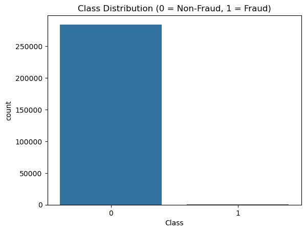
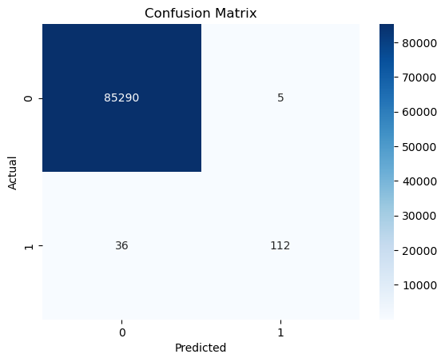
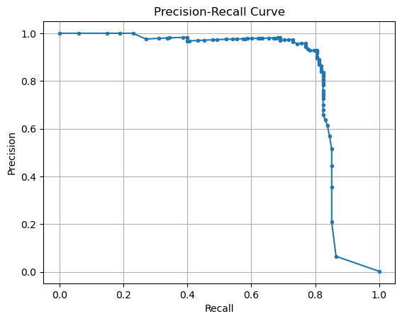

# Credit Card Fraud Detection Analysis 

This is a comprehensive analysis of a credit card transaction dataset, focusing on identifying fraudulent activities. The unique challenge of this dataset lies in its extreme class imbalance, where fraudulent transactions are very rare. The analysis covers data understanding, preprocessing, model training, and evaluation with appropriate metrics for such imbalanced scenarios.

## Project Overview
The primary objective of this project was to develop and evaluate a machine learning model capable of accurately detecting fraudulent credit card transactions. The dataset, sourced from a research collaboration involving Worldline and ULB's Machine Learning Group, contains transactions processed over two days in September 2013 by European cardholders.

## Data Description
The dataset `creditcard.csv` contains numerical input variables primarily transformed using PCA.

| Column Name | Description                                                        |
| :---------- | :----------------------------------------------------------------- |
| `Time`      | Seconds elapsed between each transaction and the first transaction. |
| `V1 - V28`  | Principal components obtained with PCA (confidential features).    |
| `Amount`    | The transaction amount.                                            |
| `Class`     | The response variable: `1` for fraud, `0` for legitimate.          |

## Data Loading & Initial Inspection
The first step in our analysis involves loading the `creditcard.csv` dataset and performing initial checks to understand its structure, content, and identify any immediate data quality issues like missing values.

Code:
```import pandas as pd
import numpy as np
import matplotlib.pyplot as plt
import seaborn as sns

from sklearn.model_selection import train_test_split
from sklearn.preprocessing import StandardScaler
from sklearn.ensemble import RandomForestClassifier
from sklearn.metrics import classification_report, confusion_matrix, precision_recall_curve, average_precision_score

# Load the dataset
df = pd.read_csv("creditcard.csv")

# Display the shape (number of rows, number of columns)
print("Dataset Shape:", df.shape)

# Display the first few rows of the dataset
print("\nFirst 5 rows of the dataset:")
print(df.head())

# Check data types and non-null counts for each column
print("\nDataFrame Info:")
df.info()

# Check for missing values in each column
print("\nMissing values per column:")
print(df.isnull().sum())

```


## Exploratory Data Analysis (EDA)

EDA was performed to gain insights into the dataset's characteristics, especially the distribution of the target variable (Class), which is crucial for fraud detection.

### Result:

| Result Field | Description                                                                                                                                           |
| :----------- | :---------------------------------------------------------------------------------------------------------------------------------------------------- |
| `Class`      | The target variable for our fraud detection model.                                                                                                    |
| `0`          | Represents **non-fraudulent** transactions. Its value (`99.827251`) indicates that approximately **99.83%** of all transactions are legitimate.   |
| `1`          | Represents **fraudulent** transactions. Its value (`0.172749`) indicates that only about **0.17%** of all transactions are fraudulent.            |


This means approximately 99.83% of transactions are legitimate (Class 0), while only a tiny 0.17% are fraudulent (Class 1). This severe class imbalance is the primary challenge in this fraud detection problem, as it can make models biased towards the majority class if not handled carefully.

A bar chart visualizing the Class distribution clearly showed a towering bar for legitimate transactions and a barely visible bar for fraudulent ones, visually emphasizing the rare nature of fraud.




## Data Preprocessing
Before feeding the dataset to the machine learning model, specific preprocessing steps were applied to optimize feature scales and relevance.

**Code:**

```
df['Amount'] = StandardScaler().fit_transform(df[['Amount']])
df.drop('Time', axis=1, inplace=True)

```

### Explanation & Results:
- **Amount Feature Scaling:** The `Amount` feature, which varied significantly in magnitude, was scaled using `StandardScaler`. This transformation centers the data around zero with a unit standard deviation, making its range comparable to the PCA-transformed `V` features. Scaling ensures that features with larger numerical values do not disproportionately influence the model's learning process.
- **Time Feature Removal:** The Time column was dropped from the dataset. While it indicates the chronological order of transactions, its raw value might not be directly predictive of fraud patterns, especially since the other core features (`V1-V28`) are already time-independent due to PCA. Removing it helps simplify the model and reduce potential noise.

## Model Training and Evaluation
This phase involved preparing the data for the machine learning model, training a classifier, and thoroughly evaluating its performance using metrics particularly relevant for imbalanced datasets.

### Explanation & Results:
- **Feature-Target Separation:** The dataset was divided into features (`X`, containing all columns except `Class`) and the target variable (`y`, containing only the `Class` column).

- **Data Splitting:** The data was split into training (70%) and testing (30%) sets. Crucially, `stratification` was applied to the `Class` variable (`y`) during splitting. This ensured that both the training and testing sets maintained the same, tiny proportion of fraudulent transactions as the original dataset, which is vital for robust evaluation in imbalanced scenarios.
  
- **Model Selection and Training:** A Random Forest Classifier was chosen for its robustness and ability to handle complex relationships. The model was initialized with 100 estimators (decision trees) and trained on the `X_train` and `y_train` data, learning patterns from the features to predict fraud.
  
- **Prediction:** After training, the model made predictions (`y_pred`) on the unseen `X_test` data.

- **Confusion Matrix:** A confusion matrix was generated to compare the model's predictions (`y_pred`) against the actual outcomes (`y_test`):

     **True Negatives (Top-Left)**: The large number of legitimate transactions correctly identified as non-fraudulent (e.g., ~85,269).

     **True Positives (Bottom-Right):** The number of actual fraudulent transactions correctly caught by the model (e.g., ~112).

     **False Positives (Top-Right):** A small number of legitimate transactions incorrectly flagged as fraud (false alarms, e.g., ~26).

     **False Negatives (Bottom-Left):** The critical number of actual fraudulent transactions that the model missed (e.g., ~36). In fraud detection, minimizing false  negatives is often a top priority.



### Classification Report: A detailed report provided key metrics:

| Metric        | Class 0 (Non-Fraud) | Class 1 (Fraud) | Explanation                                                                                                                                                                                                                                                                                                                                                        |
| :------------ | :------------------ | :-------------- | :----------------------------------------------------------------------------------------------------------------------------------------------------------------------------------------------------------------------------------------------------------------------------------------------------------------------------------------------------------------- |
| `precision`   | `0.9996`            | `0.9573`        | **Precision for Class 0**: Out of all transactions predicted as non-fraud, 99.96% were actually non-fraud. <br> **Precision for Class 1**: Out of all transactions predicted as fraud, 95.73% were actually fraud. A high value here means fewer false alarms when the model says "fraud."                                                                           |
| `recall`      | `0.9999`            | `0.7568`        | **Recall for Class 0**: Out of all actual non-fraudulent transactions, 99.99% were correctly identified. <br> **Recall for Class 1**: Out of all actual fraudulent transactions, 75.68% were correctly identified. This is crucial for fraud detection as it indicates how many actual frauds the model caught.                                              |
| `f1-score`    | `0.9998`            | `0.8453`        | A balanced score that considers both precision and recall. It's the harmonic mean of precision and recall, providing a single metric that punishes models with unbalanced precision and recall.                                                                                                                                                                    |
| `support`     | `85295`             | `148`           | The number of actual occurrences of each class in the test set. This confirms the significant class imbalance, with only 148 actual fraud cases out of 85,443 total transactions in the test set.                                                                                                                                                                     |
| `accuracy`    | `0.9995`            | (Overall)       | The overall correctness of the model. 99.95% of all predictions were correct. While high, this can be misleading for imbalanced datasets as simply predicting the majority class (non-fraud) would also yield high accuracy.                                                                                                                                       |
| `macro avg`   | `0.9784`            | `0.8783`        | The average of precision, recall, and f1-score calculated independently for each class, then averaged without considering class imbalance. Useful to see how the model performs on the minority class without being skewed by the majority.                                                                                                                        |
| `weighted avg`| `0.9995`            | `0.9995`        | The average of precision, recall, and f1-score, weighted by the number of instances for each class (`support`). This takes class imbalance into account.                                                                                                                                                                                                           |


### For the fraud class (1):

- **Precision (0.9573):** When the model predicts fraud, it is correct about 95.73% of the time, indicating a low rate of false alarms.

- **Recall (0.7568):** The model successfully identified 75.68% of all actual fraudulent transactions. This means approximately 24.32% of actual frauds were missed. Improving recall is a common goal in fraud detection to minimize undetected fraud.

### Precision-Recall Curve (PRC): 

This curve visualizes the trade-off between precision and recall at various probability thresholds. For imbalanced datasets, the PRC is a more informative evaluation tool than the ROC curve. The plot showed the relationship, ideally aiming for the curve to be close to the top-right corner.



### Average Precision (AUPRC): The area under the Precision-Recall Curve.

### Result:

- Average Precision (AUPRC): 0.8227. An AUPRC of 0.82 is considered good for such an imbalanced dataset, demonstrating the model's solid capability in distinguishing the rare fraud class from the majority legitimate class. A score closer to 1.0 would indicate a nearly perfect model.

## Conclusion
This analysis successfully demonstrates a complete machine learning pipeline for credit card fraud detection. The Random Forest Classifier proved effective, achieving a respectable AUPRC of 0.82. While the model shows high precision in its fraud predictions, there remains an opportunity to enhance its recall to minimize undetected fraudulent transactions.
